# DeepSeek Harness 源码讲解

> 面向**没听说过 Cordis**、想从零看懂 deepseek-harness 源码的读者。
> 本文基于仓库 **deepseek-ai/deepseek-harness @ 0.1.0-rc.7**（git commit `99f6f02fec`），
> 所有源码引用均给出真实文件路径与行号，你可以对照源码逐段阅读。
> 图全部由仓库同目录的 `*.mmd`（Mermaid 源码）生成，PNG 在 `images/` 下。

---

## 目录

- [0. 先看一张总图](#0-先看一张总图)
- [1. 前因后果：DeepSeek Harness 是什么，为什么长这样](#1-前因后果deepseek-harness-是什么为什么长这样)
  - [1.1 什么是 Agent Harness](#11-什么是-agent-harness)
  - [1.2 "一切皆插件" 的动机](#12-一切皆插件的动机)
  - [1.3 为什么选 Cordis](#13-为什么选-cordis)
  - [1.4 仓库形态：monorepo、vendor、双平面构建](#14-仓库形态monorepovendor双平面构建)
- [2. Cordis 到底是什么（源码级入门）](#2-cordis-到底是什么源码级入门)
  - [2.1 血统：Koishi → cordiverse → DeepSeek vendor](#21-血统koishi--cordiverse--deepseek-vendor)
  - [2.2 五个核心概念](#22-五个核心概念)
  - [2.3 源码解剖](#23-源码解剖)
  - [2.4 DSH 对 Cordis 做了什么](#24-dsh-对-cordis-做了什么)
- [3. 启动链路：从 `dsh web` 到一棵插件树](#3-启动链路从-dsh-web-到一棵插件树)
  - [3.1 命令行入口（apps/cli）](#31-命令行入口appsc-li)
  - [3.2 Profile、Bundle、Patch](#32-profilebundlepatch)
  - [3.3 `boot()` 源码走读](#33-boot-源码走读)
  - [3.4 插件树实际长什么样](#34-插件树实际长什么样)
  - [3.5 HMR：改配置不用重启](#35-hmr改配置不用重启)
- [4. 会话日志：事件溯源的核心](#4-会话日志事件溯源的核心)
  - [4.1 append-only 日志](#41-append-only-日志)
  - [4.2 surface 与 deriveMessages](#42-surface-与-derivemessages)
  - [4.3 不变量：模型可见 ⟺ 已记录](#43-不变量模型可见--已记录)
- [5. Agent 循环：从一条消息到一次回复](#5-agent-循环从一条消息到一次回复)
  - [5.1 Agent 接口与 Inbox](#51-agent-接口与-inbox)
  - [5.2 turn / step 状态机](#52-turn--step-状态机)
  - [5.3 请求组装与模型调用](#53-请求组装与模型调用)
  - [5.4 工具调用调度](#54-工具调用调度)
  - [5.5 取消与错误恢复](#55-取消与错误恢复)
- [6. 工具系统：注册表 + 执行管线](#6-工具系统注册表--执行管线)
  - [6.1 ToolDefinition](#61-tooldefinition)
  - [6.2 分层作用域（scope）](#62-分层作用域scope)
  - [6.3 执行管线五阶段](#63-执行管线五阶段)
- [7. LLM 层：适配器与流式](#7-llm-层适配器与流式)
- [8. Web GUI：宿主与浏览器两半](#8-web-gui宿主与浏览器两半)
- [9. 扩展点总表](#9-扩展点总表)
- [10. 推荐阅读路径](#10-推荐阅读路径)
- [附录 A：事件地图](#附录-a事件地图)
- [附录 B：关键文件索引](#附录-b关键文件索引)

---

## 0. 先看一张总图

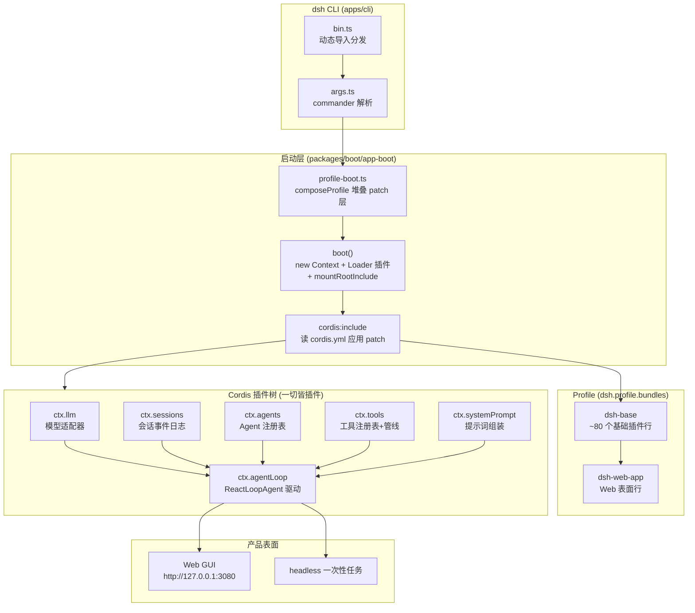
```mermaid
flowchart TD
  subgraph CLI["dsh CLI (apps/cli)"]
    BIN["bin.ts<br/>动态导入分发"]
    ARGS["args.ts<br/>commander 解析"]
  end

  subgraph BOOT["启动层 (packages/boot/app-boot)"]
    PB["profile-boot.ts<br/>composeProfile 堆叠 patch 层"]
    BOOTFN["boot()<br/>new Context + Loader 插件<br/>+ mountRootInclude"]
    INCLUDE["cordis:include<br/>读 cordis.yml 应用 patch"]
  end

  subgraph PROF["Profile (dsh.profile.bundles)"]
    B1["dsh-base<br/>~80 个基础插件行"]
    B2["dsh-web-app<br/>Web 表面行"]
  end

  subgraph TREE["Cordis 插件树 (一切皆插件)"]
    LLM["ctx.llm<br/>模型适配器"]
    SESS["ctx.sessions<br/>会话事件日志"]
    AGENT["ctx.agents<br/>Agent 注册表"]
    LOOP["ctx.agentLoop<br/>ReactLoopAgent 驱动"]
    TOOLS["ctx.tools<br/>工具注册表+管线"]
    SP["ctx.systemPrompt<br/>提示词组装"]
  end

  subgraph SURFACE["产品表面"]
    WEB["Web GUI<br/>http://127.0.0.1:3080"]
    HEAD["headless 一次性任务"]
  end

  BIN --> ARGS --> PB --> BOOTFN --> INCLUDE --> B1 --> B2
  INCLUDE --> TREE
  LLM & SESS & AGENT & TOOLS & SP --> LOOP
  LOOP --> WEB
  LOOP --> HEAD
```

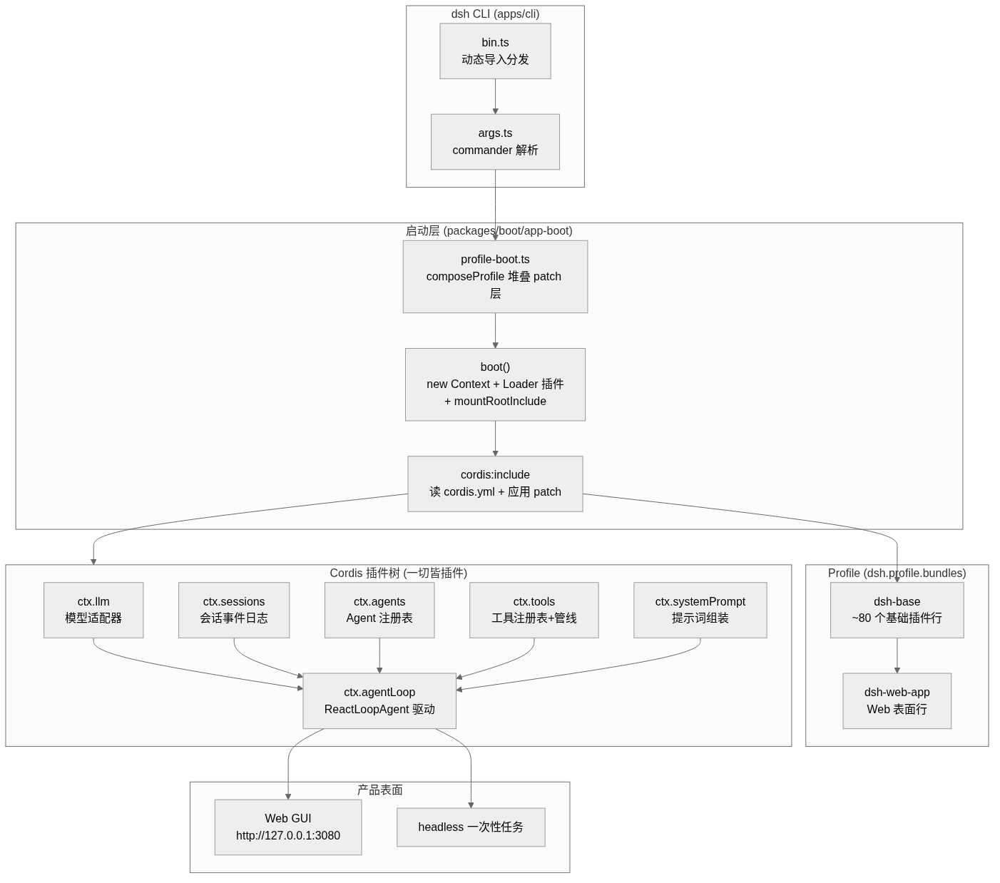

一句话版本：**dsh 是一个"用插件树拼出来的 Agent 运行时"。** 命令行只负责挑一个 profile；profile 决定堆哪几个 bundle；bundle 是一批 `cordis.yml` 插件行；Cordis 负责把这些行挂载成服务、跑起事件总线；DSH 自己的核心包（session/agent/tools/llm/agent-loop）在这棵树上互相服务；最后 Web 或 headless 只是树的"表面"。

接下来按"为什么 → Cordis 是什么 → 怎么启动 → 核心子系统源码"的顺序讲清楚。

---

## 1. 前因后果：DeepSeek Harness 是什么，为什么长这样

### 1.1 什么是 Agent Harness

先对齐一个词：**harness（"挽具"）**，在软件语境里指"把某个东西固定住并驱动它的那层壳"。AI 里的 **agent harness** 就是**运行"会自己用电脑的 AI 智能体"的那个运行时**——它负责：

- 把大模型的"想说话"变成"调用工具"（执行 bash、读写文件、调 API）；
- 记录整段会话（prompt、输出、工具调用、结果），供重放、续聊、回滚；
- 提供界面（终端、Web、IDE 插件）；
- 提供沙箱、审批、权限、凭据等安全边界。

你熟悉的 Claude Code、Cursor Agent、OpenHands 都是这个品类。DeepSeek 在 2025 年开源了它的实现：**DeepSeek Harness（`dsh`）**，当前是开发者预览版（0.1.0-rc.7），版本上明确说"未来会有破坏性变更"，所以它是一个**地基优先**的项目。

### 1.2 "一切皆插件" 的动机

仓库 README 第一句话就是："It adopts an **everything is a plugin** architecture"（一切皆插件）。为什么？

关键线索在它引用的论文里：[_A Programming Paradigm for Spatiotemporal Composability_](https://github.com/cordiverse/paper)（可翻译为"时空可组合的编程范式"）。这篇论文主张软件应该像**可逆、可组合**的系统来写：

- **可组合**：功能 = 一组可以任意叠加的模块，而不是写死的整体；
- **可逆**：每个模块的"注册"都是副作用，卸载/回滚时**能把自己收拾干净**；
- **可观测**：运行中的系统可以被检查，甚至可以**被自己修改**。

对 agent harness 来说这三点尤其诱人：

1. **模型适配器、工具、提示词片段、持久化、沙箱……全是插件**，部署时可以按 profile 自由拼装，用户可以用一小段 YAML 覆盖任何一行；
2. **没有"特权核心"**：想扩展 dsh，不是去改它的源码，而是在"旁边挂一个插件"；插件卸载时，它注册的所有东西自动撤销（这就是"自己改完，还能收拾干净"）；
3. 更进一步，DSH 甚至允许**agent 在运行时检查并修改自己的插件树**（仓库里有 `packages/extensions`，专门给模型一套"看自己、挂自己"的工具），这是"自进化蓝图"的由来——媒体说它"让 AI 开发像玩乐高拼插件"就是这个意思。

要支撑这套东西，DSH 需要一个**本身就为"插件 + 可逆副作用"而生的框架**，而不是再发明一个。它选了 Cordis。

### 1.3 为什么选 Cordis

**Cordis 是什么**（第 2 节详讲）：一个"元框架"（meta-framework）——不是直接给你 agent 功能，而是给你**组织插件、服务、事件、生命周期的一套规则**。它的出身和 DSH 的需求几乎严丝合缝：

- 出身：**Koishi**（一个聊天机器人框架，作者 Shigma）的底层就是 Cordis 前身；后来独立成通用框架，由 **cordiverse** 组织维护。它已经在 Koishi 生态里被海量插件代码验证过"插件树 + 热重载 + 可逆副作用"的可靠性；
- 能力：类型化事件（emit/waterfall/parallel/serial/bail）、服务注入（inject）、作用域隔离（isolate）、配置拦截（intercept）、插件热重载（HMR）——DSH 需要的每一样它都有；
- 许可：MIT，可以放心 vendoring（把源码拷进自己的仓库）。

DSH 不是 npm install cordis 就完事，而是**把 Cordis 源码整个 vendor 进仓库**（`vendor/cordis`），重新打成 `@deepseek-ai/cordis` 作用域包。为什么这么重？仓库 `vendor/README.md` 写明：harness 要**完全拥有自己的框架层**（可审计、可打补丁、可钉住版本），并且要对自己的框架做深度改造（下文 2.4 会列）。

> 一句话前因后果：**DeepSeek 要做一个"一切皆插件、可被自己修改"的 agent 运行时 → 需要一个成熟的插件框架 → 选中了出身于 Koishi 生态的 Cordis → 把它 vendor 进来深度改造 → 在上面用约 50 个 npm 包搭出 session/agent/tools/llm 等核心能力 → 用 bundle+patch 把它们拼成 web/headless 等 profile。**

### 1.4 仓库形态：monorepo、vendor、双平面构建

看仓库根目录（`package.json` + `pnpm-workspace.yaml`）先建立几个事实：

**① pnpm monorepo**，workspace 成员分几层：

| 路径 | 内容 |
|---|---|
| `vendor/*` | vendored 的 Cordis 全家桶（cordis、loader、include、hmr、timer、group、cosmokit、schemastery、logger-console） |
| `packages/<group>/<pkg>` | 约 50 个 `@deepseek-ai/dsh-*` 包，按能力分组（`core/`、`llm/`、`session/`、`subagent/`、`web/`、`bundle/`……） |
| `apps/*` | 产品外壳：`apps/cli`（dsh 命令）、`apps/web`（Vite 前端入口） |
| `python/`、`native/` | Python SDK/运行时、Landlock 沙箱原生模块 |
| `examples/` | 可运行的 cordis.yml 演示叶 |

**② 双平面构建**：`pnpm run build` 分 `build:lib`（tsc + tsdown 编译所有包到 `lib/`）和 `build:web`（构建前端）。源码用 `src/`，发布/运行用 `lib/`。这解释了为什么你会看到 `packages/core/session/src/` 和 `lib/types/` 并存。

**③ 版本**：`packageManager: pnpm@11.7.0`，要求 Node `^22.19 || >=24`，全部 ESM（`"type": "module"`）。

## 2. Cordis 到底是什么（源码级入门）

这是全文最重要的一节——**DSH 的每个角落都在用 Cordis 的概念**，不懂它，看后面每一段源码都会卡壳。

### 2.1 血统：Koishi → cordiverse → DeepSeek vendor

Cordis 的官方定位是 **"Meta-Framework for Modern JavaScript Applications"**（现代 JS 应用的元框架，见 `vendor/cordis/package.json` 的 description）。它的历史大致是：

1. **出身于 Koishi**：Koishi 是中文社区很有名的**聊天机器人框架**（可以接 QQ/Telegram/Discord，靠"插件生态"出名）。它的作者 **Shigma**（`vendor/cordis/package.json` 里 author 字段写着 `Shigma <shigma10826@gmail.com>`）在写 Koishi 的过程中，把"插件 + 服务 + 事件 + 热重载"这套内核逐步抽出来，形成了 Cordis 的前身；
2. **独立成通用框架**：后来这个内核被独立成 **cordiverse/cordis** 仓库（cordiverse 是围绕它的一圈插件/工具的组织），Koishi 新版也迁移到它上面（Koishi 官方仓库里就有 "migrate to latest cordis API" 这样的提交）；
3. **被 DeepSeek 选中并 vendor**：DSH 把它**连源码带历史**拷进自己的仓库（`vendor/` 目录），按 `pnpm-workspace.yaml` 的 `linkWorkspacePackages` 机制把 npm 包名重映射成 `@deepseek-ai/cordis` 等作用域名。上表可见：cordis 4.0.0-rc.7、commit `56b3d4f…`，还连带 vendor 了 cosmokit（工具库）、schemastery（配置 schema 校验）、loader/include/hmr/timer/group（插件加载五件套）。

> 一个容易混淆的点：Cordis **不是** agent 框架，它不知道 LLM、不知道工具调用。它是一个**通用的插件容器**——DSH 只是把它当底座，在上面实现 agent 语义。这也是"选型"上最精彩的一步：agent 运行时最难的"可组合 + 可逆"问题，直接复用了聊天机器人生态十几年的积累。

### 2.2 五个核心概念

仓库自带的入门文档 `docs/cordis-primer.zh.md` 把 Cordis 浓缩成五个概念，我逐条配上源码佐证：

| 概念 | 一句话 | 源码位置 |
|---|---|---|
| **插件 Plugin** | 一个函数（带 `apply(ctx)`）或 `Service` 子类；被挂载到某个上下文 | `vendor/cordis/src/registry.ts` |
| **上下文 Context** | 服务的容器；`ctx.<key>` 直接取服务 | `vendor/cordis/src/context.ts` |
| **inject 依赖声明** | 插件声明要哪些服务，声明齐了才激活 | `vendor/cordis/src/registry.ts` |
| **类型化事件** | 服务间通过事件通信；有 5 种分发模式 | `vendor/cordis/src/events.ts` |
| **可逆效应 Effect** | 一切注册都是副作用，卸载时自动撤销 | `vendor/cordis/src/fiber.ts` |

DSH 里到处都是这五件事：`ctx.on('session/event', ...)` 是事件；`ctx.tools.register(...)` 返回一个 disposer（可逆效应）；`inject: [webStartup]` 写在 cordis.yml 行里（依赖声明）；`ctx.llm.stream()` 是服务调用。

### 2.3 源码解剖

#### 2.3.1 Context：一个 Proxy

`vendor/cordis/src/context.ts` 最反直觉的一点是：**`Context` 类本身不存服务，它是个 Proxy**。构造器（L71-84）最后 `return self` 返回的是一个代理：

```ts
// context.ts L71-84（节选）
constructor() {
  this[symbols.isolate] = Object.create(null)
  this[symbols.intercept] = Object.create(null)
  const self = new Proxy<this>(this, ReflectService.handler)
  this.root = self
  this.baseUrl = undefined
  this.fiber = new Fiber(self, {}, Object.create(null), null, () => [])
  this.reflect = new ReflectService(self)
  this.registry = new RegistryService(self)
  this.events = new EventsService(self)
  this.logger = new LoggerService(self)
  this.fiber._disposables.clear()
  return self  // 注意：返回的是 Proxy！
}
```

所以当你写 `ctx.llm` 时，属性读取会被 `ReflectService.handler` 拦截：先在隔离表/拦截表里查，再查服务注册表（`ctx.reflect.get`）。DSH 的所有核心服务就是这样"长"在 ctx 上的：`ctx.sessions`、`ctx.agents`、`ctx.tools`、`ctx.llm`…… 每个都是某个插件 `provide` 出来的 `Service` 实例。

`Context` 还有三个派生方法（L99-145）：

- `extend(meta)`：造一个原型继承自己的**子上下文**（DSH 每个 agent 都有自己的 `agent.ctx`）；
- `isolate(name, label)`：子上下文里把某个服务名**隔离开**，可以挂不同的实现（比如给某个 agent 单独一份 tools 视图）；
- `intercept(name, config)`：子上下文里给某类服务**注入额外配置**。

#### 2.3.2 Service：注册到 ctx.<key>

`vendor/cordis/src/service.ts` 的 `Service` 基类极其简洁：构造时 `ctx.reflect.provide(name, this, check)`，把自己的实例注册成 `ctx.<name>`，并且**随挂载它的 fiber 自动卸载**（L42-59）。DSH 的每个能力都是它的子类：

```ts
// dsh-session: class SessionStore extends Service
// dsh-agent:   class AgentRegistry extends Service
// dsh-tools:   class ToolRuntime extends Service
// dsh-llm:     class LlmRuntime extends Service
```

#### 2.3.3 Events：五种分发模式

`vendor/cordis/src/events.ts` 定义了 `DispatchMode = 'emit' | 'parallel' | 'serial' | 'bail' | 'waterfall'`（L32）。DSH 文档里的"事件模式"表就来自这里：

| 模式 | 是否 await | 顺序 | 返回值 | 用途示例（DSH） |
|---|---|---|---|---|
| `emit` | 否 | 按注册顺序观察 | 无 | `session/event`（日志广播）、`agent/status` |
| `parallel` | 是 | 全部并行 | 无 | `session/flush`（持久化落盘检查点） |
| `serial` | 是 | 顺序执行直到 bail | 首个非空结果 | `agent/turn-stopping`（拦截停轮） |
| `bail` | 否 | 同步顺序直到 bail | 首个非空结果 | 内部监听器注册钩子 |
| `waterfall` | 否* | 洋葱式环绕 | 最外层返回值 | `agent/pre-step`、`tools/execute`、`llm/stream` |

**waterfall 是 DSH 用得最狠的**，值得单独理解。看 `events.ts` L234-243 的实现：

```ts
waterfall(...args: any[]) {
  const cbs = this.dispatch('waterfall', args)
  const inner = args.pop()   // 最后一个参数是内置行为（next 链的最里层）
  const next = () => {
    const cb = cbs.shift() ?? inner
    return cb(...args)
  }
  args.push(next)
  return next();   // 从最外层监听器开始
}
```

监听器签名是 `(...args, next)`：调用 `next()` 就继续往内层走，**不调用 next() 直接 return 就是短路**（否决）。DSH 的规则（`docs/cordis-primer.zh.md`）：waterfall 监听器**必须调 next() 委托**，除非你有权做决策。例如 `tools/execute` 的超时包装器：包一层 `next()`，外面卡表计时；策略监听器想拒绝就直接返回错误结果，不调 next()。

#### 2.3.4 Fiber 与 Effect：可逆副作用

`vendor/cordis/src/fiber.ts` 管理**一个插件实例的生命周期**（状态机 PENDING → LOADING → ACTIVE → UNLOADING → DISPOSED，加载失败进 FAILED）。`ctx.effect(fn)` / `ctx.on(...)` 会把注册动作记到当前 fiber 的 disposables 里；fiber 卸载时**逆序执行**所有 disposer。这就是"一切注册都是可逆副作用"的实现：

```ts
// 一个典型 DSH 插件片段（概念示例）
export function apply(ctx: Context) {
  ctx.on('session/event', handler)              // 卸载自动移除监听
  return ctx.tools.register(toolDefinition)     // 返回 disposer，卸载自动注销工具
}
```

热重载（HMR）就是"卸载旧 fiber → 撤销全部注册 → 挂新 fiber → 重新注册"，所以 DSH 敢承诺**改配置不用重启**。

#### 2.3.5 Loader / Include：从 YAML 到插件树

光有 API 还不够——还得能从**配置文件**描述"挂哪些插件"。Cordis 生态给了两个配套插件，DSH 也 vendor 了：

- **Loader**（`@deepseek-ai/cordis-plugin-loader`）：读一个**插件列表**，为每一项创建 fiber、按 inject 依赖排序激活、管理生命周期和热更新；
- **Include**（`@deepseek-ai/cordis-plugin-include`）：loader 之上的"include"节点——它把自己当成一行插件，但它读的是 `cordis.yml`（一个 YAML 插件行数组），并且支持 **patch**（按 id 覆盖/插入行）和 **`!!js` 表达式**（YAML 里写 `port: !!js ctx.webStartup.port ?? 3080`，挂载时求值）。

DSH 的"配置树"= Include 读 `cordis.yml` + 叠加若干 patch 层。`!!js` 表达式是 DSH 配置的灵魂，后面 3.4 会看到大量例子。

### 2.4 DSH 对 Cordis 做了什么

vendor 不是白拷——`vendor/README.md` 里记录了一长串**本地修改**（Local modifications），几个对理解 DSH 很重要的：

- **生命周期加固**（cordis/fiber.ts）：修了重入式卸载的几个竞态，保证"卸载时新注册的东西逃不掉"；
- **事务化 Loader/Include 配置协调**：改配置失败会回滚到旧插件/旧配置，而不是挂掉；
- **patch 语义导出**：把 Include 私有的 patch 算法抽成公开的 `applyEntryPatches`，让 `dsh --dump-config` 能**不启动**就打印出最终配置树（这保证"你看到的配置 = 实际挂载的配置"）；
- **HMR 精确文件监听**：`cordis.patch.yml` 改了就增量重挂，串行化避免死锁；
- **`@deepseek-ai` 重新命名空间**：整个框架层发布为 DeepSeek 自己的 npm 包，避免占用上游包名。

结论：**DSH 的框架层是它自己的**——上游 Cordis 负责通用能力，本地补丁负责 DSH 特有的"配置可组合、可回滚、可热更"承诺。

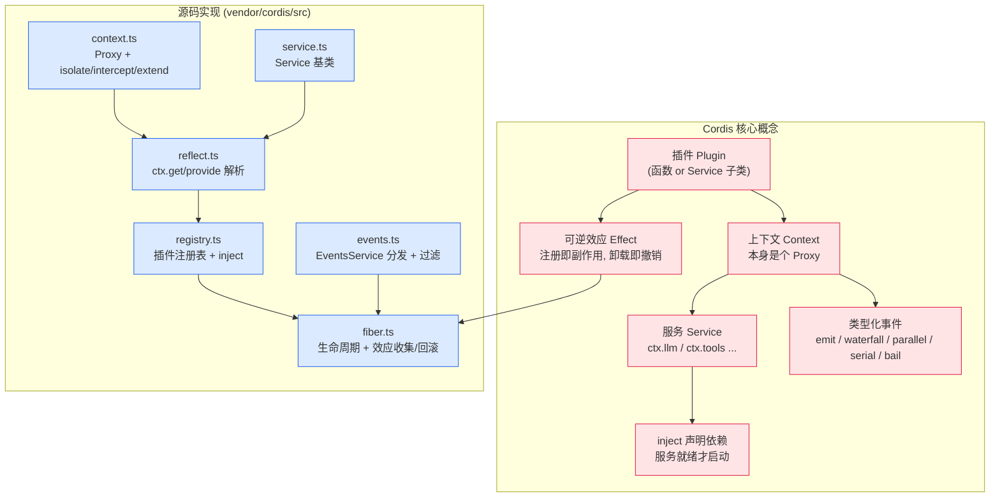
```mermaid
flowchart TD
  subgraph CORE["Cordis 核心概念"]
    PLUGIN["插件 Plugin<br/>(函数 or Service 子类)"]
    CTX["上下文 Context<br/>本身是个 Proxy"]
    SERVICE["服务 Service<br/>ctx.llm / ctx.tools ..."]
    INJECT["inject 声明依赖<br/>服务就绪才启动"]
    EVENTS["类型化事件<br/>emit / waterfall / parallel / serial / bail"]
    EFFECT["可逆效应 Effect<br/>注册即副作用, 卸载即撤销"]
  end

  subgraph IMPL["源码实现 (vendor/cordis/src)"]
    CTXCLS["context.ts<br/>Proxy + isolate/intercept/extend"]
    REFLECT["reflect.ts<br/>ctx.get/provide 解析"]
    REG["registry.ts<br/>插件注册表 + inject"]
    EVSVC["events.ts<br/>EventsService 分发 + 过滤"]
    FIBER["fiber.ts<br/>生命周期 + 效应收集/回滚"]
    SVC["service.ts<br/>Service 基类"]
  end

  PLUGIN --> CTX
  CTX --> SERVICE
  SERVICE --> INJECT
  CTX --> EVENTS
  PLUGIN --> EFFECT
  EFFECT --> FIBER

  CTXCLS --> REFLECT --> REG --> FIBER
  EVSVC --> FIBER
  SVC --> REFLECT

  classDef pink fill:#ffe4e6,stroke:#e11d48
  classDef blue fill:#dbeafe,stroke:#2563eb
  class PLUGIN,CTX,SERVICE,INJECT,EVENTS,EFFECT pink
  class CTXCLS,REFLECT,REG,EVSVC,FIBER,SVC blue
```

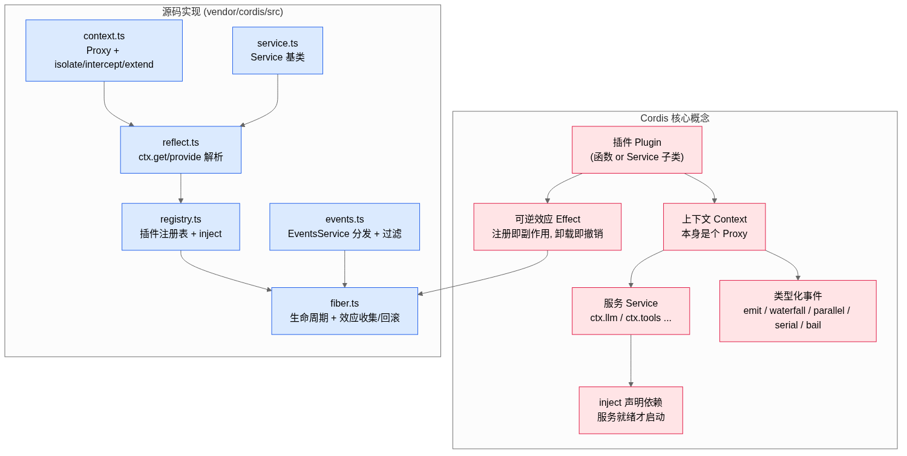

## 3. 启动链路：从 `dsh web` 到一棵插件树

这一节把"按下 `dsh web` 后发生了什么"完整走一遍。整个过程都在 **apps/cli** 和 **packages/boot/app-boot** 两个包里。

### 3.1 命令行入口（apps/cli）

**`apps/cli/src/bin.ts`（53 行）是真正的进程入口**（package.json 的 `bin: { dsh: lib/bin.js }`）。它做的事极简：

```ts
// bin.ts L27-53（节选）
const invocation = parseDshArgs(process.argv.slice(2), readVersion())
switch (invocation.mode) {
  case 'profile': {
    const { runProfile } = await import('./profile-boot.ts')
    await runProfile({ environment: loadLayeredEnv('dsh'),
      profile: invocation.profile, patchFiles: invocation.patches, args: invocation.args })
    break
  }
  case 'plugin':  // 转发给 pnpm 管理 profile 的插件依赖
  case 'dump-config':  // 打印组合后的配置树, 不启动
}
```

两个值得注意的设计：

- **按模式动态 import**：`profile` / `plugin` / `dump-config` 三个模式只在命中时加载对应模块，互不污染；
- **launcher 只解析自己的参数**。`apps/cli/src/args.ts` 用 commander 解析 `--profile`、`--patch`、`--dump-config`，遇到**第一个不认识**的 token 就停手，把剩下的原样交给启动后的 app 插件（`dsh --profile web --port 8080` 里 `--port` 是 Web app 的，不是 dsh 的）。

### 3.2 Profile、Bundle、Patch

这是 DSH 最核心的"组合模型"，三件套：

| 概念 | 是什么 | 放在哪 |
|---|---|---|
| **Profile（档案）** | 一个命名组合：堆哪些 bundle + 用户自己的覆盖层 | `$DSH_HOME/profiles/<name>/`（默认 `~/.dsh/profiles/`） |
| **Bundle（束）** | 一坨 Cordis 配置行 + 它们挂载的代码；是"可分发的 patch 层" | npm 包，`package.json` 里 `dsh.bundle.patch` 指向 `cordis.patch.yml` |
| **Patch（补丁层）** | 按行 id 覆盖配置 / 插入新行的 YAML 数组 | 每个 profile 的 `cordis.patch.yml`、`$DSH_HOME/cordis.patch.yml`、`--patch` 文件 |

你机器上真实的 web profile（`~/.dsh/profiles/web/package.json`）长这样：

```json
{
  "name": "dsh-profile-web",
  "dsh": { "profile": { "bundles": [
    "@deepseek-ai/dsh-base",
    "@deepseek-ai/dsh-web-app"
  ] } }
}
```

而 profile 目录里的 `cordis.yml` 永远是一行 `[]`（空数组，见 `profile-boot.ts` L60-64 的 `PROFILE_ROOT_CONFIG`）——**整个插件树全是 patch 出来的**，这就是"空根 + 分层"：

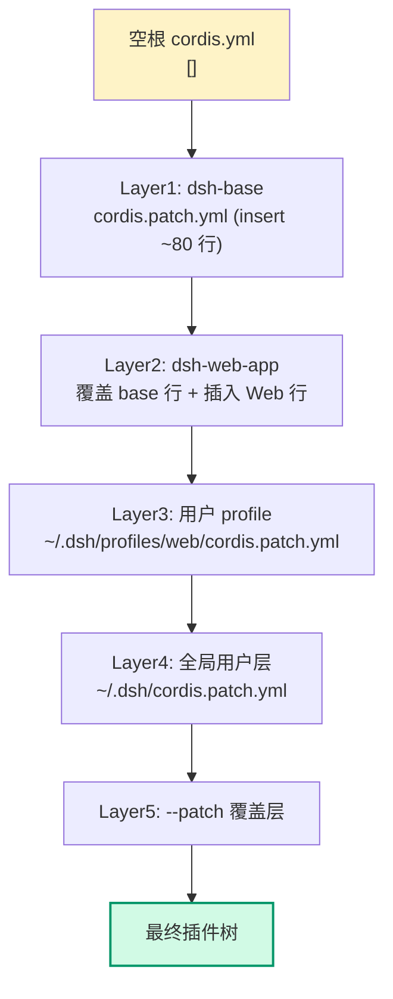
```mermaid
flowchart TD
  ROOT["空根 cordis.yml<br/>[]"] --> BASE["Layer1: dsh-base<br/>cordis.patch.yml (insert ~80 行)"]
  BASE --> WEBAPP["Layer2: dsh-web-app<br/>覆盖 base 行 + 插入 Web 行"]
  WEBAPP --> PROFP["Layer3: 用户 profile<br/>~/.dsh/profiles/web/cordis.patch.yml"]
  PROFP --> HOMEP["Layer4: 全局用户层<br/>~/.dsh/cordis.patch.yml"]
  HOMEP --> OVER["Layer5: --patch 覆盖层"]
  OVER --> TREE["最终插件树"]

  style ROOT fill:#fef3c7
  style TREE fill:#d1fae5,stroke:#059669,stroke-width:2px
```

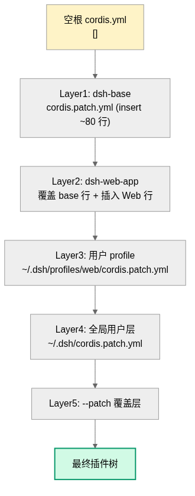

**patch 的语义**（`cordis-plugin-include`）：一个 patch 要么 `- id: xxx` 带新 `config`（**整体替换**目标行的配置，不是 merge），要么 `- insert:` 插入一批新行。层与层**后者赢**——同 id 最后写的人生效。这就是为什么 dsh 敢说"配置树里打印出的任何一行，你都能用一小段 YAML 覆盖"。

### 3.3 `boot()` 源码走读

`apps/cli/src/profile-boot.ts` 的 `runProfile()`（L207-299）把上面几层拼好（`composeProfile`，L142-171），然后调用 `packages/boot/app-boot/src/index.ts` 的 **`boot()`**（L757-802）。`boot()` 是整个启动的灵魂，逐段看：

```ts
// app-boot/src/index.ts L757-802（节选）
export async function boot(binName, absoluteConfigPath, patches?, prepare?, bareModuleBaseUrl?) {
  const ctx = new Context()                      // ① 根上下文（Proxy）
  try {
    ctx.baseUrl = pathToFileURL(dirname(absoluteConfigPath)).href + '/'
    ctx.provide('dshHomePath', dshHomePath)    // ② 给 !!js 表达式提供 dshHomePath()
    await ctx.plugin(Loader)                    // ③ 先挂 Loader 插件
    await prepare?.(ctx)                        // ④ 宿主准备(注入 cmdline/env 快照)
    await mountRootInclude(ctx, absoluteConfigPath, patches, bareModuleBaseUrl)
    // ⑤ 挂 cordis:include: 读 cordis.yml + 应用 patch 层
    await ctx.get('loader')?.await()            // ⑥ 等整棵树 settle
    await assertEntriesActivated(ctx, binName)  // ⑦ 审计: 每个启用的行必须 ACTIVE
    return ctx
  } catch (cause) {
    await ctx.fiber.dispose()                   // 失败就整体回滚
    throw new Error(`${binName}: ${stage}: ...`, { cause })
  }
}
```

第⑤步 `mountRootInclude`（L486-529）值得展开：它往 loader 里塞了一个 id 固定为 `include`、name 为 `cordis:include` 的行，config 里带 `path`（cordis.yml 的 file URL）和 `patches`。Include 插件挂载时：读 YAML → 用 `entryListSchema`（带 `!!js` 方言的 schema）解析 → 应用 patch 列表 → 把结果交给 Loader 逐行挂载。

第⑦步 `assertEntriesActivated`（L692-725）是"fail loud"（大声失败）原则：启动完必须**每个启用的行都处于 ACTIVE**，否则把失败的插件名、等待的服务列出来直接抛错。禁用行是唯一合法的"没有 fiber"状态。

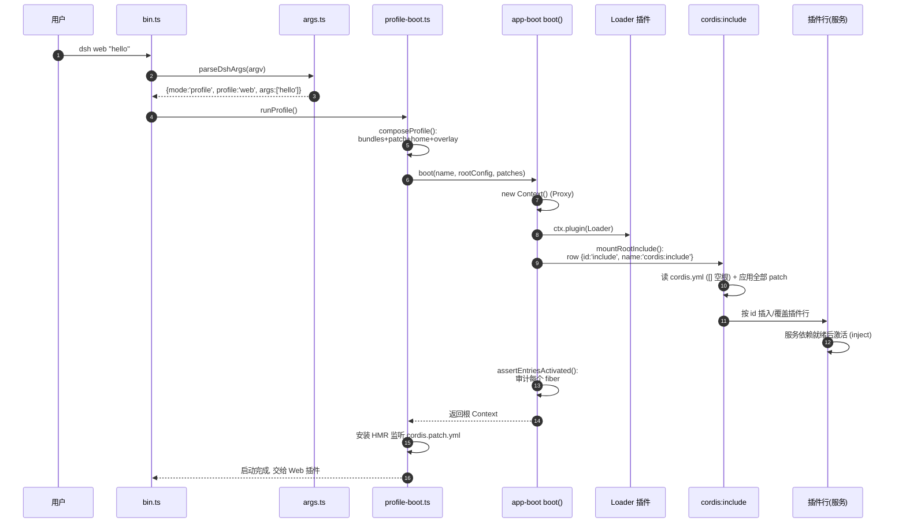
```mermaid
sequenceDiagram
  autonumber
  participant U as 用户
  participant B as bin.ts
  participant A as args.ts
  participant PB as profile-boot.ts
  participant AB as app-boot boot()
  participant LD as Loader 插件
  participant INC as cordis:include
  participant ROW as 插件行(服务)

  U->>B: dsh web "hello"
  B->>A: parseDshArgs(argv)
  A-->>B: {mode:'profile', profile:'web', args:['hello']}
  B->>PB: runProfile()
  PB->>PB: composeProfile():<br/>bundles+patch+home+overlay
  PB->>AB: boot(name, rootConfig, patches)
  AB->>AB: new Context() (Proxy)
  AB->>LD: ctx.plugin(Loader)
  AB->>INC: mountRootInclude():<br/>row {id:'include', name:'cordis:include'}
  INC->>INC: 读 cordis.yml ([] 空根) + 应用全部 patch
  INC->>ROW: 按 id 插入/覆盖插件行
  ROW->>ROW: 服务依赖就绪后激活 (inject)
  AB->>AB: assertEntriesActivated():<br/>审计每个 fiber
  AB-->>PB: 返回根 Context
  PB->>PB: 安装 HMR 监听 cordis.patch.yml
  PB-->>B: 启动完成, 交给 Web 插件
```

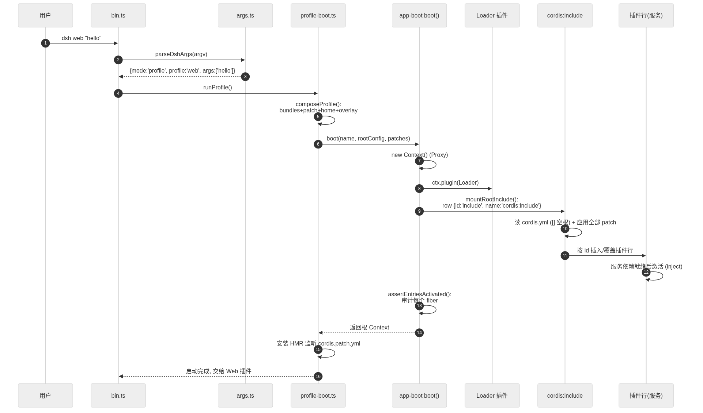

### 3.4 插件树实际长什么样

跑 `dsh --profile web --dump-config` 能看到最终组合的完整行列表。这里按 `packages/bundle/base/cordis.patch.yml` 和 `packages/bundle/web-app/cordis.patch.yml` 把重点行分类列一下：

**dsh-base 的 ~80 行**（节选，按功能分组）：

| 分组 | 行 id（都是插件） | 作用 |
|---|---|---|
| 基础设施 | `timer`、`hmr` | 定时器、热重载 |
| LLM | `llm`、`llm-pi-ai`、`llm-retry`、`llm-deepseek` | 模型服务 + 双供应商适配器 + 重试 |
| 会话 | `session`、`session-persistence-jsonl`、`session-projection`、`session-title`、`session-query-sqlite` | 事件日志 + JSONL 持久化 + 投影 + 标题 |
| Agent | `agent`、`agent-default-model`、`agent-loop` | 注册表 + 默认模型 + 循环驱动 |
| 工具 | `tools`、`tool-bash`、`tool-pwsh`、`tool-fs`、`tool-fs-search`、`tool-jobs`、`tool-skill`、`tool-todo`、`tool-goal`、`tool-subagent`、`tool-workflow`、`tool-ralph`、`tool-str-replace-editor`、`tool-web` | 工具注册表 + 一个个具体工具 |
| 执行环境 | `subprocess`、`sandbox`、`bash-sandbox`、`pwsh-sandbox`、`fs-sandbox` | 子进程 + 沙箱 |
| 安全 | `approval`、`permission`、`fs-observation-policy` | 审批、权限、文件观测策略 |
| 智能体能力 | `goal`、`goal-round-driver`、`plan-mode`、`compaction-basic`、`subagent`、`subagent-*-in-process`、`workflow-worker-thread` | 目标、计划、压缩、子代理、工作流 |
| 提示词 | `system-prompt`、`agent-instructions`、`skill`、`skill-filesystem` | 提示词组装、指令、技能 |
| 凭据设置 | `settings`、`credentials` | 用户设置 + 凭据引用 |

**dsh-web-app 加的 Web 表面行**（节选）：

- 覆盖 base：`system-prompt`（加 persona）、`hmr`（禁用——Web 端热重载生命周期没测完，先用 launcher 的 watch-only 兜底）、`tools`（支持 `DSH_TOOLS_MODE` 环境变量临时切换 Code Mode）；
- 新增宿主行：`code-runtime`、`storage`、`workspace`、`api-gateway`（= `dsh-host-apiproxy`）、`web-startup`、`webserver`、`web-runtime`、`modules`、`api-remotes`、`client-runtime`；
- 新增浏览器行：`ui-conversation`、`ui-tool`、`ui-goal`、`ui-settings`、`ui-subagent`、`ui-workflow-run`…… 一整套 UI 插件。

注意 `webserver` 行的配置——**你正在用的 3080 端口就是从这里来的**：

```yaml
# web-app/cordis.patch.yml
- id: webserver
  name: '@deepseek-ai/dsh-host-webserver'
  inject: [webStartup]        # 等 webStartup 服务就绪
  config:
    host: !!js ctx.webStartup.host ?? '127.0.0.1'
    port: !!js ctx.webStartup.port ?? 3080   # !!js = 挂载时求值
```

### 3.5 HMR：改配置不用重启

启动收尾时（`profile-boot.ts` L268-298）会做两件事：

1. 如果树里没有 `hmr` 服务，就补挂一个 **watch-only** 的 HMR（`cordis-plugin-hmr`，module root 为空数组）；
2. 对 profile 的 `cordis.patch.yml` 和 `$DSH_HOME/cordis.patch.yml` 各注册一个 `registerConfig()` 精确监听（`app-boot` 的 `watchUserPatches`，L232-265）。

文件一变，回调就把**当前用户层重新读一遍**，用 `composeLive` 重新拼出完整 patch 列表（bundle 层在下、overlay 在上，保证用户层永远改不动 bundle 层），然后事务性更新根 Include——Loader 会**卸载旧行、挂新行**。这就是 DSH 文档承诺的"改 `cordis.patch.yml` 不重启，立刻生效"。

一个工程细节：`composeLive` 每次用 `structuredClone` 克隆 patch 对象（L240-245），因为 Include 的 `insert` 是**按引用**塞进树的，复用同一个解析对象会把用户覆盖"烤"进 bundle 的插入行，导致删掉覆盖也回不去默认值。

## 4. 会话日志：事件溯源的核心

**DSH 的会话不是一个"消息数组"，而是一条 append-only 的事件日志。** 这是全仓库最深刻的一个设计决定，值得先理解动机：

- 模型看到的上下文、UI 渲染、持久化、回放、fork、标题、遥测——**全都从同一条日志派生**，任何一方都不会有自己的"另一份真相"；
- 你要"续聊"或"回滚"，只是从日志里重放/截断；
- 测试可以用录制的日志做**确定性回放**（仓库里有整套 snapshot 测试体系）。

### 4.1 append-only 日志

`packages/core/session/src/index.ts` 的 `Session` 类核心是 `log: SessionEvent[]`，每个事件有递增的 `seq`。事件类型是**声明合并**出来的类型化 map（`SessionEventMap`，在 `src/types.ts`），典型事件：

| 事件 | 谁写的 | 内容 |
|---|---|---|
| `turn/start` / `turn/end` | agent-loop | 轮次边界 + 结束原因（completed/max-tokens/aborted/error/blocked） |
| `step/start` / `step/end` | agent-loop | 步骤边界 |
| `user/message` | agent-loop / 外部 | 用户消息（含注入的上下文） |
| `assistant/chunk` | agent-loop | **每个**流式分块（保 UI 还原度和重放保真） |
| `assistant/message` | agent-loop | 组装好的助手消息（引用 sourceEventSeqs） |
| `tool/call` / `tool/result` | 工具调度器 | 工具调用与结果（result 引用 call 的 seq） |
| `request/header` / `request/context` | agent-loop | 请求配置（模型、system、tools）与上下文窗口 |

`append()` 做四件事：校验（`snapshotJsonValue` 保证**无损 JSON 可序列化**，见 `src/json.ts`）→ 深度冻结（`deepFreeze`）→ 推入日志 → 广播 `session/event` 事件。持久化插件（如 `dsh-session-persistence-jsonl`）订阅 `session/event` 落盘，`session/flush` 是等待落盘的并行检查点。

### 4.2 surface 与 deriveMessages

日志是"全量真相"，但模型不需要 chunk 和轮次边界——模型要的是**一段干净的 Message 数组**。于是有 **surface**（`src/surface.ts`）：每个"产生消息"的事件在 append 时带 `surfaceOp` 标记（`append`/`replace`），surface 维护一个**节点列表**，compaction 的 `replace` 会把被压掉的节点从推导里删除。

`deriveMessages()`（L726-747）就是"日志 → 模型历史"的投影，带缓存（O(新节点)）：

```ts
// session/src/index.ts L726-747（节选）
deriveMessages(): Message[] {
  const surface = this.surface
  const nodes = surface.nodes
  // surface 换代（一次 replace）就清缓存重建
  if (generation !== this.derivedGeneration) {
    this.derived = []; this.derivedNodes = 0; this.derivedGeneration = generation
  }
  for (const seq of nodes.slice(this.derivedNodes)) {
    const msg = this.deriveEventMessage(this.log[seq]!)
    if (msg) this.derived.push(msg);   // 空内容的 max-tokens 步骤推导为 null
  }
  this.derivedNodes = nodes.length
  return [...this.derived];   // 新数组; Message 对象共享且已冻结
}
```

### 4.3 不变量：模型可见 ⟺ 已记录

仓库 AGENTS.md 里有一条硬规则：**"Model-visible ⟺ logged"（模型可见的必须已记录）**——任何进入模型请求的东西都必须能从日志重建。后果是：你想给模型加一种新输入（比如注入一段上下文），就必须**新增一种 SessionEvent**，而不是悄悄拼进请求里。这条不变量是 DSH 事件溯源纪律的基石，也解释了为什么 `agent.inject()` 会把注入物先变成日志事件再进请求。

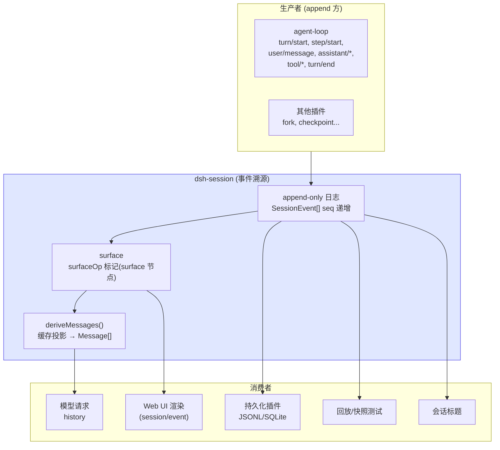
```mermaid
flowchart TD
  subgraph PRODUCERS["生产者 (append 方)"]
    L["agent-loop<br/>turn/start, step/start,<br/>user/message, assistant/*,<br/>tool/*, turn/end"]
    O["其他插件<br/>fork, checkpoint..."]
  end

  subgraph CORE["dsh-session (事件溯源)"]
    LOG["append-only 日志<br/>SessionEvent[] seq 递增"]
    SURF["surface<br/>surfaceOp 标记(surface 节点)"]
    DERIVE["deriveMessages()<br/>缓存投影 → Message[]"]
  end

  subgraph CONSUMERS["消费者"]
    LLMC["模型请求<br/>history"]
    UI["Web UI 渲染<br/>(session/event)"]
    PERS["持久化插件<br/>JSONL/SQLite"]
    REPLAY["回放/快照测试"]
    TITLE["会话标题"]
  end

  PRODUCERS --> LOG --> SURF --> DERIVE --> LLMC
  LOG --> PERS
  LOG --> REPLAY
  SURF --> UI
  LOG --> TITLE

  style CORE fill:#e0e7ff,stroke:#4f46e5
```

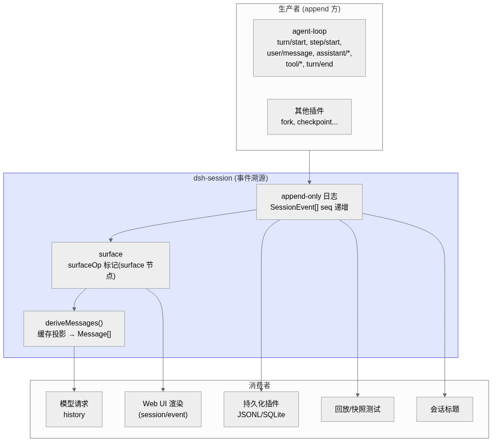

## 5. Agent 循环：从一条消息到一次回复

核心源码在 **`packages/core/agent-loop/src/agent.ts`**（`ReactLoopAgent`，496 行）和 **`packages/core/agent/src/index.ts`**（`AgentRegistry`）。先明确两个词，后面所有代码都围绕它们：

- **step（步骤）**：一次模型请求 + 它触发的工具调用；
- **turn（轮次）**：零到多个 step，从收到输入开始，到"不再欠任何响应"结束。

### 5.1 Agent 接口与 Inbox

`Agent` 接口（`packages/core/agent/src/runtime-types.ts` + `index.ts`）暴露给外部的是一个**极小的面**：`send()`、`followup()`、`steer()`、`inject()`、`cancel()`、`whenIdle()`、`runMaintenance()`。它们统统收敛到一个 **Inbox（收件箱）**——所有输入先排队，循环从队列取：

```ts
// agent-loop/src/agent.ts L113-140
send(message: UserMessage, target: InboxTarget, wakeup: boolean): void {
  // 唤醒消息不能加入被中止的活动，改投下一轮
  const wakingAfterAbort = wakeup && this.phase.kind !== 'idle'
    && this.phase.abort.signal.aborted;
  const resolvedTarget = wakingAfterAbort ? 'next-turn' : target;
  this.inbox.splice(resolvedTarget, Infinity, 0, [message])
  if (wakeup) this.wakeDriver(wakingAfterAbort)
}

followup(input) { this.send(input, 'next-turn', true) }  // 下一轮, 唤醒
steer(input)    { this.send(input, 'next-step', true) }  // 本轮下一步, 唤醒
inject(input)   { this.send(input, 'next-step', false) } // 本轮下一步, 不唤醒
```

Inbox 里有两类目标：`next-turn`（下一轮才领）和 `next-step`（当前 step 结束马上领）。`inject()` 不唤醒——注入的上下文**静默等待**下一条真正唤醒的消息（这就是文档说的"injected context waits in the inbox"）。

每个 Agent 还有自己的 **scope（作用域）**（`agent.ts` L94-96）：

```ts
this.scope = createScope(loopCtx, this)   // dsh-scope: 一个不透明 key
this.ctx = this.scope.ctx.extend({ agent: this })
```

`agent.ctx` 是**这个 agent 专属的注册边界**：通过它注册的工具、提示词片段、监听器，只对这个 agent 生效，agent 销毁时一并撤销。`dsh-scope` 的 `scopeTarget()` 给事件分发加了路由过滤——监听器属于祖先 scope 的能收到后代事件，反之不行（事件只向上流动）。这是"一个 UI 插件能观察所有 agent"与"工具按 agent 隔离"两个需求的同一实现。

### 5.2 turn / step 状态机

`ReactLoopAgent` 内部有一个显式的 phase 联合类型（L38-46）：

```ts
type Phase =
  | { kind: 'idle'; lastTurn: number }
  | { kind: 'maintenance'; abort: AbortController; lastTurn: number; wakeRequested: boolean }
  | { kind: 'running'; abort: AbortController; turn: number; step: number; wakeRequested: boolean }
```

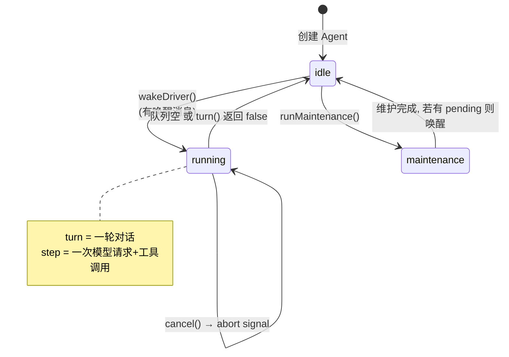
```mermaid
stateDiagram-v2
  [*] --> idle: 创建 Agent
  idle --> running: wakeDriver()<br/>(有唤醒消息)
  running --> running: turn() 循环<br/>while(await this.turn())
  running --> idle: 队列空 或 turn() 返回 false
  idle --> maintenance: runMaintenance()
  maintenance --> idle: 维护完成, 若有 pending 则唤醒
  running --> running: cancel() → abort signal
  note right of running
    turn = 一轮对话
    step = 一次模型请求+工具调用
  end note
```

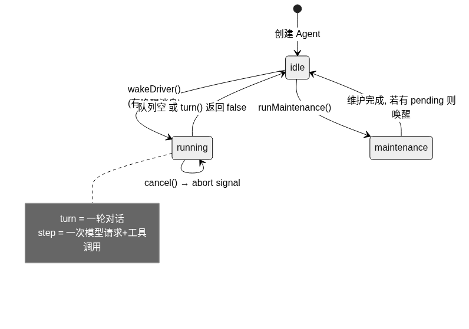

**`turn()`（L246-330）是状态机的核心**。骨架如下（去掉注释后只有 ~40 行）：

```ts
// agent-loop/src/agent.ts L246-330（骨架）
private async turn(): Promise<boolean> {
  const phase = this.phase
  const { signal } = phase.abort
  const turn = phase.turn + 1
  this.session.append('turn/start', { turn });   // ① 先落日志
  phase.turn = turn
  let turnEnds: TurnEndReason | null = null
  let target: InboxTarget = 'next-turn'
  try {
    while (true) {
      const step = phase.step + 1
      const decision = await this.preStep(target, { turn, step });  // ② 领取输入
      if (decision.kind === 'reject') { turnEnds = { kind: 'blocked' }; return false }
      if (turnEnds && decision.messages.length === 0) break
      if (phase.step === 0 && decision.messages.length === 0) {  // 空首步不开模型调用
        turnEnds = { kind: 'completed' }; return false
      }
      this.session.append('step/start', { turn, step });   // ③ step 边界
      phase.step = step
      for (const message of decision.messages) {
        this.session.append('user/message', message, { surfaceOp: 'append' })
      }
      const stepEnd = await this.step(decision.assembly);   // ④ 模型+工具
      if (turnEnds === null || turnEnds.kind !== 'max-tokens') turnEnds = stepEnd
      this.session.append('step/end', { turn, step });
      if (turnEnds && this.inbox.nextStep.length === 0) {
        await this.dispatch.serial('agent/turn-stopping', { turn, signal });  // ⑤ 停轮拦截
      }
      if (turnEnds && this.inbox.nextStep.length === 0) break
      target = 'next-step';   // 还有 next-step 输入 → 继续下一步
    }
  } catch (error) {
    turnEnds = signal.aborted
      ? { kind: 'aborted', reason: signal.reason as AgentCancelCause }
      : { kind: 'error', error: /* 结构化错误 */ };
    this.throwError(error)
  } finally {
    this.session.append('turn/end', { turn, reason: turnEnds! });  // ⑥ 必落 turn/end
  }
  if (!this.inbox.hasPending) return false
  phase.abort = new AbortController();  // 新轮次换新控制器
  phase.step = 0;
  return true;   // 还有活 → 再开一轮
}
```

六个要点：

1. **日志先行**：`turn/start` 先落日志，任何后续失败都能从日志重建"这轮开始了"；
2. **`preStep` 是决策点**：从 inbox 领输入 → 组装提示词 → 发 **`agent/pre-step` waterfall**。监听器可以改写消息（比如追加注入的上下文），或直接 `reject`（策略拒绝时整轮以 `blocked` 收场，连模型都不调）；
3. **空首步也闭环**：被移除的唤醒消息/被改写空的 enter，仍然开一个"没花模型调用"的轮次并落 `turn/end`——日志忠实记录尝试；
4. **max-tokens 是粘性的**：任一 step 撞上限，后面的 step 即使正常完成也不把结局降级；
5. **`agent/turn-stopping` 是串行拦截**：整轮结束前最后一个说话机会（无 next()，监听器直接决定停不停）；
6. **错误全部结构化**：`LlmError` 保留失败事实，其他错误折叠成 `{message, code:'UNKNOWN'}`；取消则记录 `aborted` 加原因。

`preStep`（L225-243）细节：先 `inbox.claim(target, turn)` 领取，再 `systemPrompt.assemble(agentCtx)` 组装提示词，`renderContextSections` 渲染段落，最后 waterfall `agent/pre-step`，默认行为是"消息 + 注入的 runtime context"。

### 5.3 请求组装与模型调用

`step()`（L332-401）是"一次模型调用 + 工具执行"的完整回合，`buildRequest()`（L407-495）负责把请求拼出来。请求组装有两条硬纪律：

1. **请求是日志的纯函数**：`buildRequest` 用 `session.deriveMessages()` 得到历史，请求被 `deepFreeze` 冻结（改它直接抛错），并打上 `markAgentLoopRequest` 标记——这是"模型可见 ⟺ 已记录"的执行面；
2. **请求配置走 `agent/request` waterfall**：任何插件都能在模型调用前改写 provider/model/reasoningEffort/maxTokens（比如按会话状态切模型）。

```ts
// agent-loop/src/agent.ts L438-470（节选）
const proposedConfig = await this.dispatch.waterfall(
  'agent/request', { turn, step, signal },
  () => Promise.resolve(seedConfig),   // 默认: 持久化的 header 配置
)
// ... 解析 adapter 默认值(prepareCall) ...
const header = canonicalHeader({ config, ...system ? { system } : {},
  ...tools.length > 0 ? { tools } : {} })
if (!this.requestHeaderLogged) {
  this.session.append('request/header', { header, reason: 'initial' })
  this.requestHeaderLogged = true
} else if (headerEquals(baseline, header) === false) {
  this.session.append('request/header', { header, reason: 'change' })
}
```

然后真正调模型（L343-390）：

```ts
const stream = preparedCall?.stream(request) ?? this.loopCtx.llm.stream(request)
for await (const chunk of stream) {
  signal.throwIfAborted()
  chunkSeqs.push(this.session.append('assistant/chunk', { turn, step, chunk }).seq)
  assembler.push(chunk)   // BlockAssembler 把分块拼成内容块
}
const finish = assembler.finish
if (finish.kind === 'error' || finish.kind === 'aborted') {
  // waterfall agent/request-error: 监听者可以决定 retry
  if (action?.kind !== 'retry') throw new LlmError(...)
  continue;   // 重试再来一轮 while
}
this.session.append('assistant/message', { turn, step, message,
  ...assembler.usage === undefined ? {} : { usage: assembler.usage } },
  { surfaceOp: 'append', sourceEventSeqs: chunkSeqs })
```

注意：**每个分块都是日志事件**（`assistant/chunk`，带 seq），组装好的 `assistant/message` 通过 `sourceEventSeqs` 引用它们——UI 能精确还原流式打字效果，回放测试能逐块核对。流式层的细节（SSE 解析、重试、空闲看门狗）在 `packages/llm/llm-deepseek/src/adapter.ts`（`DeepSeekAdapter`）和 `packages/llm/llm-retry`。

### 5.4 工具调用调度

`step()` 拿到 `assistant/message` 后，把其中的 `tool-call` 块交给 **`executeToolCalls()`**（`agent-loop/src/tool-calls.ts`，L59-101）。调度器按**并发模式**分组执行：

- **exclusive（独占）**：一个调用形成一个 barrier，必须等它完成；
- **parallel（并行）**：多个调用进一个有界滚动池（`maxParallelToolCalls`，默认来自 `ctx.agentLoop.config`），但**结果永远按模型顺序提交**（`commitReady` 只推进连续已就绪的槽位）。

```ts
// tool-calls.ts L84-100（骨架）
while (next < planned.length) {
  const first = planned[next]!
  const mode = ctx.tools.executionMode(first.exec).kind;  // 每次重新判定
  const group = mode === 'parallel' ? planned.slice(next) : [first];
  const outcome = await runGroup(ctx, turn, step, group, mode, signal, acceptContext)
  next += outcome.consumed;
  concluded ||= outcome.concluded;
  if (outcome.aborted) { /* 未启动的调用补记合成错误结果 */ return { concluded } }
}
```

为什么"每次重新判定"？因为**注册表可能在执行中途变化**（热更新、agent 作用域调整），调度器要尊重最新的执行模式。工具结果以 `tool/result` 事件落日志，携带 `sourceEventSeqs: [callSeq]` 引用对应的 `tool/call`。

### 5.5 取消与错误恢复

整条链路的每个 await 后都有 `signal.throwIfAborted()`——**AbortSignal 贯穿始终**。`cancel()`（L134-140）做两件事：清 inbox（除非 `keepInbox`）＋ abort 当前活动的 signal。被中止的 step 会在 `turn()` 的 catch 里变成 `{kind:'aborted', reason}` 的 `turn/end`。

工具层的取消更讲究（`tools/src/index.ts` 的 `cancellationStates`）：区分"**body 是否已经开始跑**"——没开始 → `ABORTED_BEFORE_DISPATCH`；开始了 → 等它自然收敛（**绝不丢弃一个已启动的 promise**）再标 `ABORTED`。调度器层（`tool-calls.ts` L237-241）对被跳过/未启动的调用**补记合成错误结果**（`Error: tool call aborted before dispatch`），保证回放日志永远是闭合的。

错误恢复的主战场是 `agent/request-error` waterfall：流在 `error`/`aborted` 终结时，监听者（比如 retry 插件）可以决定重试（`action.kind === 'retry'` → `continue` 再发一次请求），否则抛 `LlmError`。

### 5.6 完整时序

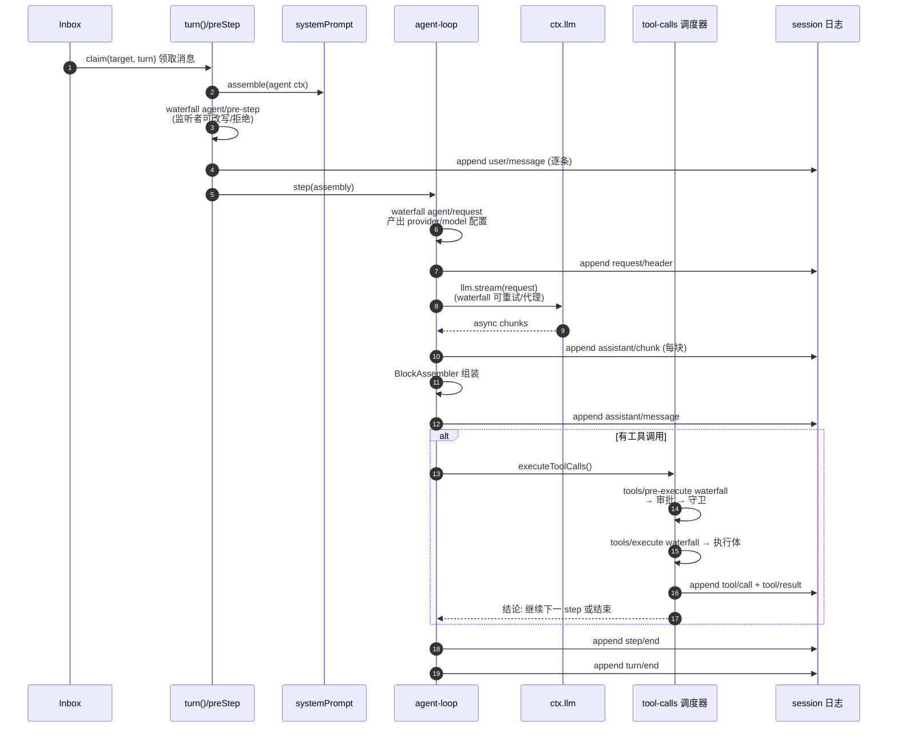
```mermaid
sequenceDiagram
  autonumber
  participant IN as Inbox
  participant TL as turn()/preStep
  participant SP as systemPrompt
  participant L as agent-loop
  participant LLM as ctx.llm
  participant TC as tool-calls 调度器
  participant LG as session 日志

  IN->>TL: claim(target, turn) 领取消息
  TL->>SP: assemble(agent ctx)
  TL->>TL: waterfall agent/pre-step<br/>(监听者可改写/拒绝)
  TL->>LG: append user/message (逐条)
  TL->>L: step(assembly)
  L->>L: waterfall agent/request<br/>产出 provider/model 配置
  L->>LG: append request/header
  L->>LLM: llm.stream(request)<br/>(waterfall 可重试/代理)
  LLM-->>L: async chunks
  L->>LG: append assistant/chunk (每块)
  L->>L: BlockAssembler 组装
  L->>LG: append assistant/message
  alt 有工具调用
    L->>TC: executeToolCalls()
    TC->>TC: tools/pre-execute waterfall<br/>→ 审批 → 守卫
    TC->>TC: tools/execute waterfall → 执行体
    TC->>LG: append tool/call + tool/result
    TC-->>L: 结论: 继续下一 step 或结束
  end
  L->>LG: append step/end
  L->>LG: append turn/end
```

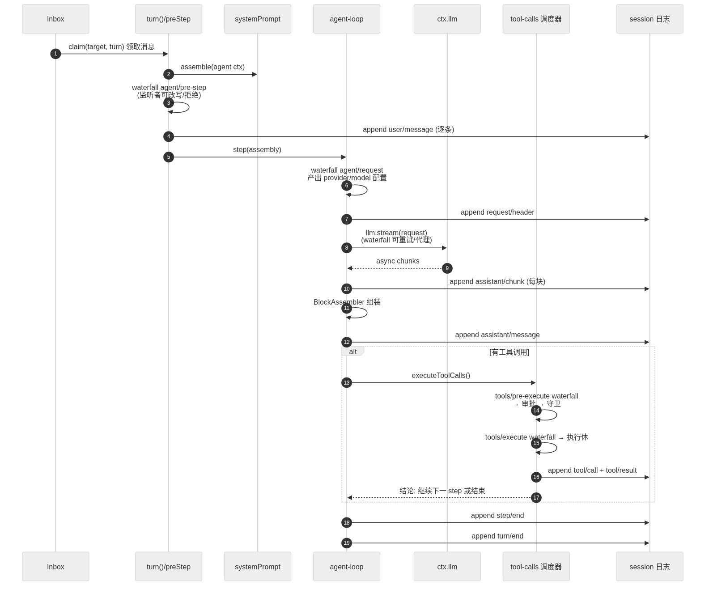

### 5.7 Agent 的创建与生命周期

`AgentRegistry`（`core/agent/src/index.ts`）是 `ctx.agents` 服务：一个 **live 注册表**（Map<SessionId, AgentEntry>）＋一个 **factory 槽位**。真正创建 agent 的是 `dsh-agent-loop` 插件（`agent-loop/src/index.ts`）：它实现 `AgentFactory.createAgent()`——mint 未发布的 scope → await setup（组装 agent 的世界）→ 顺序发布 `session/created`、`agent/created`、`agent/session-start` → 启动循环。**setup 组合、不驱动**：一切注册先于任何公告，失败整体回滚。

`AgentRegistry` 还管理**发起者（initiator）作用域**：用 `AsyncLocalStorage` 记住"当前这段异步工作是哪个 agent 发起的"（`withInitiator`），工具执行、子代理、日志都靠它做**因果归属**——比如你在 UI 里看到"这个 tool/result 是主 agent 调用子代理得到的"。

## 6. 工具系统：注册表 + 执行管线

工具是 agent 的"手"。DSH 的工具系统（**`packages/core/tools/src/index.ts`**，`ToolRuntime`，1946 行）把"注册工具"和"执行工具"分开成两个正交的维度：注册看**作用域**，执行走**管线**。

### 6.1 ToolDefinition

一个工具就是一份 `ToolDefinition`（L222 附近）：

```ts
interface ToolDefinition extends ToolSchema {
  name: string
  description: string;
  parameters: JSON Schema;      // 模型可见的参数 schema
  execute(args, exec): Promise<unknown>;   // 执行体
  // 可选: 超时、渲染意图、内容终结器...
  timeoutMs?: number;
  output?: { schema; render(args, value); presentationMeta? };  // UI 渲染意图
}
```

注册（`register()`，L1037-1062）做严格校验：必须有合法的 `output` 声明、schema 必须受支持、`run_code` 是保留名（它是 Code Mode 的传输工具，谁都不能注册/遮蔽）。注册返回**精确的 disposer**，unmount 即注销。

### 6.2 分层作用域（scope）

工具注册表是**分层的**（`ScopedLayers`，`scope/src/store.ts`）：

- **全局层**：通过普通 ctx 注册，所有 agent 可见；
- **agent 层**：通过某个 `agent.ctx` 注册，只有那个 agent 可见，**遮蔽**同名的全局工具；
- **restrict（限制）**：`ctx.tools.restrict({allow|deny})` 只允许在 agent scope 上调用——给某个 agent 裁掉一批全局工具（交集语义：多个 restrict 取交集）。

```ts
// tools/src/index.ts L1037-1061（节选）
register(definition: ToolDefinition): () => void {
  // ...校验 name/output/timeoutMs/保留名...
  return this.layers.effect(this.ctx,
    layer => layer.tools.insert(name, definition),  // 按 ctx 的 scope 落层
    { label: 'tools.register()' })
}
```

### 6.3 执行管线五阶段
一次工具执行不是直接调 `execute`，而是穿过一条**可插拔管线**（`execute()` L1342 → `prepareExecution` L1463-1507 → `dispatchToolBody` L1532+）：

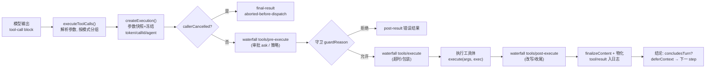
```mermaid
flowchart LR
  A["模型输出<br/>tool-call block"] --> B["executeToolCalls()<br/>解析参数, 按模式分组"]
  B --> C["createExecution()<br/>参数快照+冻结<br/>token/callId/agent"]
  C --> D{"callerCancelled?"}
  D -- 是 --> E["final-result<br/>aborted-before-dispatch"]
  D -- 否 --> F["waterfall tools/pre-execute<br/>(审批 ask / 策略)"]
  F --> G{"守卫 guardReason"}
  G -- 拒绝 --> H["post-result 错误结果"]
  G -- 允许 --> I["waterfall tools/execute<br/>(超时/包装)"]
  I --> J["执行工具体<br/>execute(args, exec)"]
  J --> K["waterfall tools/post-execute<br/>(改写/收尾)"]
  K --> L2["finalizeContent + 物化<br/>tool/result 入日志"]
  L2 --> M["结论: concludesTurn?<br/>deferContext → 下一 step"]
```

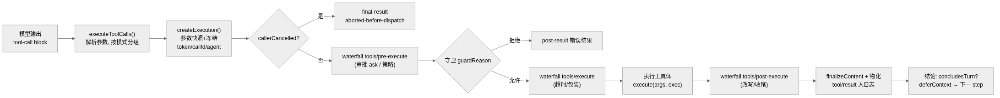

五个阶段拆开看：

1. **createExecution**：参数 `snapshotJsonValue` 无损快照＋`deepFreeze`（模型给的 JSON 不能带函数/循环引用），mint 一个 execution token 与 callId 关联，捕获 `finalizeContent` 回调；
2. **`tools/pre-execute` waterfall**：第一个可扩展门。监听者可以：`allow` 放行、`ask` 要求人工审批（走 `approval` 服务）、或直接 `deny`。守卫（`guard()`，单调的，注册在 waterfall 之后）再查一次——**任何守卫拒绝即拒绝，守卫不能互相放行**；
3. **`tools/execute` waterfall**：第二个可扩展门，包住真正执行体。超时插件（`dsh-tool-call-timeout-policy`）就在这里包一层；
4. **post-execute**：结果出来后的改写权（脱敏、压缩、追加上下文）。`final-result` 直接跳过它（比如"没开始就取消"这类确定性结果）；
5. **物化**：`finalizeContent` 收尾 → 结果按模型顺序写成 `tool/result` 日志事件（带 UI 的 `meta` 呈现载荷）。`concludesTurn` 标记告诉调度器"这个工具宣告本轮结束"；`deferContext` 把工具追加的上下文放进下一 step 的 inbox。

管线全程以 `scopeTarget(this, exec.agent)` 作为分发载体——**工具执行事件按 agent 路由**，UI 插件只看到自己关心的 agent 的工具活动。

## 7. LLM 层：适配器与流式

**`packages/llm/llm`**（`LlmRuntime`，`ctx.llm`）是模型能力的 Service Definition，它不做传输，只定义词汇表和适配器槽位：

- **`llm/stream` waterfall**（`llm/src/index.ts` L64）：每次模型调用的可拦截点。监听者可以代理请求（换 provider）、做重试、或注入自己的 chunk 短路；
- **适配器注册表**：`LlmAdapter` 抽象类 + 注册/解析逻辑；`prepareCall()` 把配置和**适配器注册时的默认值**绑定成一个 `PreparedLlmCall`（这样"模型默认的 reasoningEffort/maxTokens"和用户配置能精确分层）；
- **`BlockAssembler`**（`assembler.ts`）：把 `StreamChunk` 流拼成内容块（文本/思考/工具调用），并统计 usage；
- **错误分类**：`LlmError` 带稳定 code（`AUTH`/`RATE_LIMIT`/`NO_ADAPTER`/`QUOTA_EXCEEDED`…），可序列化为 `LlmFailure` 进日志。

具体供应商实现是两个独立包：

| 包 | 实现 | 特点 |
|---|---|---|
| `packages/llm/llm-deepseek` | `DeepSeekAdapter`：fetch + SSE 打 DeepSeek 的 OpenAI 兼容端点 | 传输层纯净；连接事实经 `options()` thunk 每次重读；bearer token 每次经 `resolveApiKey` 解析（凭据与端点同一次解析，杜绝"URL 是新的、key 是旧的"） |
| `packages/llm/llm-pi-ai` | 基于 pi-ai 的多供应商适配器 | base 行里默认"休眠"：settings 里给出供应商 profile 才注册路由；这正是 Web 的 Models 页在写的设置 |

注册在 `llm-deepseek` 的 index.ts（base bundle 的 `llm-deepseek` 行）：从 `credentials` 服务解析 `apiKeyEnv` 引用 → 构造 adapter → `ctx.llm.register()`。**哪些适配器存在是组合问题（cordis.yml 决定），哪些 provider 在跑是用户的设置文档问题（settings.yaml 决定）**——这一条就是"一切皆插件"在模型层的体现。

## 8. Web GUI：宿主与浏览器两半

你现在正在用的这个界面，就是 dsh 的 Web profile。它分**宿主（Node 进程）**与**浏览器（前端）**两半，中间走 HTTP/WebSocket。

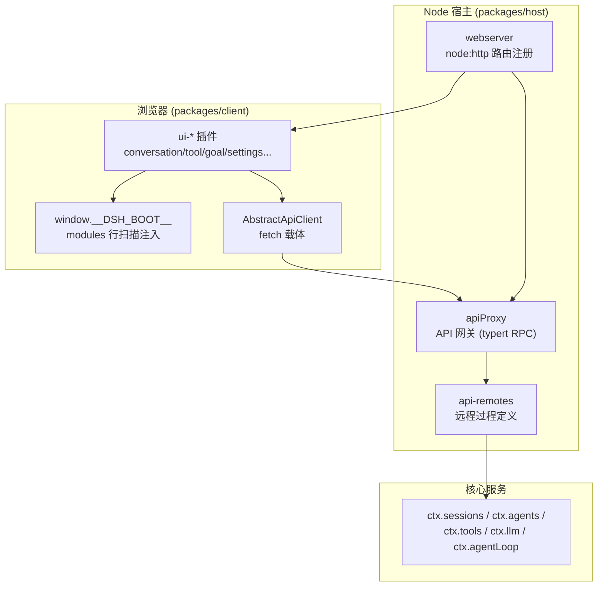
```mermaid
flowchart TD
  subgraph BROWSER["浏览器 (packages/client)"]
    BOOT["window.__DSH_BOOT__<br/>modules 行扫描注入"]
    UI["ui-* 插件<br/>conversation/tool/goal/settings..."]
    CLIENT["AbstractApiClient<br/>fetch 载体"]
  end

  subgraph HOST["Node 宿主 (packages/host)"]
    WS["webserver<br/>node:http 路由注册"]
    API["apiProxy<br/>API 网关 (typert RPC)"]
    REM["api-remotes<br/>远程过程定义"]
  end

  subgraph CORE2["核心服务"]
    S["ctx.sessions / ctx.agents /<br/>ctx.tools / ctx.llm / ctx.agentLoop"]
  end

  UI --> BOOT
  UI --> CLIENT --> API
  API --> REM --> S
  WS --> API
  WS --> UI
```

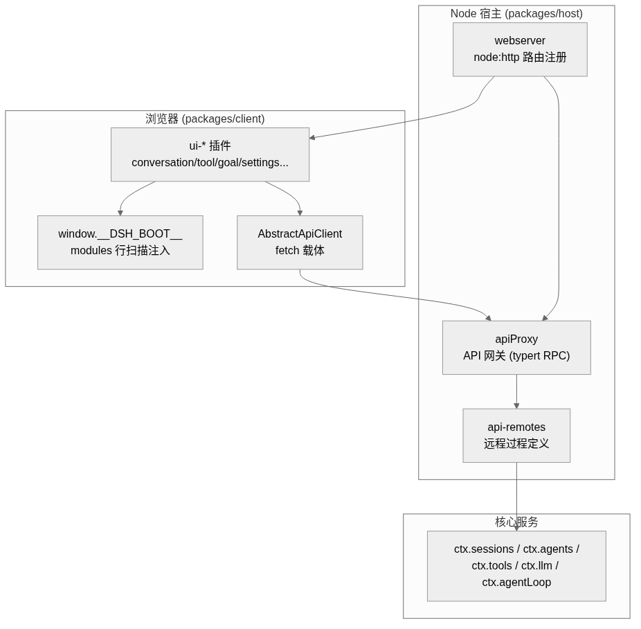

**宿主侧**（`packages/host/`）：

- `dsh-host-webserver`：一个纯 `node:http` 服务器（知道 HTTP，不知道任何 harness 概念）。插件往里注册路由（exact/prefix）和 upgrade 路由；没被认领的请求落到唯一的 fallback 座位（由 `web-runtime` 行挂的 `frontend-static` 负责 serve 打包好的前端 dist）；
- `dsh-host-apiproxy`（`api-gateway` 行）：**API 网关**。定义一套类型化的 API 契约（`api/` 目录，zod schema），宿主实现 + 浏览器客户端共用同一套契约；
- `packages/api/gateway`：Typert 网关——DSH 自研的类型图系统（`packages/typert`）把 TS 类型序列化到 wire，让"服务端类型 = 客户端类型"成为运行时事实。

**浏览器侧**（`packages/client/`）：

- 浏览器**不是写死的单页**，它也是插件树：`modules` 行扫描出所有 `dsh.client` 标注的插件行，把它们的代码 bundle 注入 `window.__DSH_BOOT__`，浏览器运行时按 roster 逐行挂载（`client-runtime`、`cordis-client-runner`）；
- `ui-*` 插件（`ui-conversation`、`ui-tool`、`ui-goal`、`ui-settings`……）各自注册 UI 组件与交互逻辑——**和宿主端一样按行拼装**；
- `connection` 管 WebSocket/事件推送，`session/event` 事件从宿主流到浏览器，驱动聊天界面增量渲染。

一个有意思的对称：**宿主和浏览器是同一棵 Cordis 树的两个面**——宿主跑 Node 插件，浏览器跑 UI 插件，共享同一套"配置行 + 事件 + 服务"心智模型。这也是为什么 web-app bundle 里会有 `dsh.client` 这样标注的行：它们是被打包进浏览器 roster 的"客户端插件"。

## 9. 扩展点总表

DSH 官方架构文档 `docs/architecture.md` 有一张"新行为往哪挂"的表，是全仓库最实用的速查，我翻译并浓缩如下：

| 你想做… | 挂在哪 | 机制 |
|---|---|---|
| 加一个模型供应商 | `ctx.llm` 注册 adapter | 服务 |
| 加一个模型能力（工具） | `ctx.tools.register()`；schema 自动进提示词组装 | 服务 + 注册表 |
| 给某个会话不同的能力集 | 组合一个 agent preset（`isolate` realm） | 配置 + 作用域 |
| 加 shell 执行 | `ctx.shell` 后端；本地实现走 `ctx.subprocess` | 能力缝 |
| 加持久化终端 | `ctx.terminals` 后端 + `dsh-tool-terminal` | 能力缝 |
| 加人工命令 | `ctx.commands`（不走模型轮） | 服务 |
| 加后台任务 | `ctx.jobs`；`job_*` 工具收集/停止 | 服务 + 工具 |
| 加文件访问或策略 | `ctx.fs` provider 或监听 `fs/*` 事件 | 能力缝 + 事件 |
| 限制子进程 | `ctx.sandbox` 后端 | 能力缝 |
| 拦截请求/工具/轮次 | `agent/*`、`tools/*` 事件；`agent/turn-stopping` 停轮 | 事件 |
| 加模型可见上下文 | `agent.inject()`，落到下一个被接纳的请求 | 服务 + 日志 |
| 加 UI/编辑器集成 | 驱动 `ctx.agents`，渲染 `session/event` | 服务 + 事件 |
| 加 Web 聊天节点 | `ConversationNodeDefinition` + keyed 渲染器 | 客户端插件 |
| 加持久会话状态 | 扩展 `SessionEventMap`；从日志渲染/重放 | 日志 |
| 生成会话标题 | 注册唯一的 `ctx.sessionTitle` provider | 服务 |
| 同会话目标管理 | `ctx.goals`；通过 `agent/*` 继续 | 服务 |
| 给一个 agent 划注册边界 | 用那个 agent 的 `agent.ctx` | 作用域 |

## 10. 推荐阅读路径

按这个顺序读源码，收获最大：

1. `docs/architecture.md`（中英双语都有）——先把官方地图过一遍；
2. `docs/cordis-primer.zh.md` + `vendor/cordis/src/context.ts`、`events.ts`——把 Cordis 五个概念钉死；
3. `apps/cli/src/`（bin/args/profile-boot）+ `packages/boot/app-boot/src/index.ts`——看懂启动；
4. `packages/bundle/base/cordis.patch.yml` + `packages/bundle/web-app/cordis.patch.yml`——看真实的插件树；
5. `packages/core/session/src/index.ts`——事件溯源与 deriveMessages；
6. `packages/core/agent-loop/src/agent.ts` + `tool-calls.ts`——循环本体（对照本指南第 5 节）；
7. `packages/core/tools/src/index.ts`——工具管线（对照第 6 节）；
8. `packages/llm/llm/src/index.ts` + `packages/llm/llm-deepseek/src/adapter.ts`——LLM 层；
9. 最后挑一个你感兴趣的"能力缝"（subagent / goal / workflow / fs / shell）读它的 README 与 src。

配套资料：仓库 `docs/` 下还有 `tool-execution-pipeline.md`、`agent-lifecycle.md`（官方时序图）、`event-producer-consumer.md`（事件生产者/消费者地图）、`subsystems/`（每个子系统的类型与 API 参考）、`cookbook/`（手把手扩展教程）。

## 附录 A：事件地图

三个事件域（`docs/architecture.md` 的官方分法）：

| 域 | 例子 | 语义 |
|---|---|---|
| **session 事件** | `session/created`、`session/event`、`session/flush`、`turn/*`、`step/*`、`user/message`、`assistant/*`、`tool/*` | 落日志的**持久事实**，重载后仍在；UI、回放、持久化都从这里派生 |
| **agent 事件**（`agent/*`） | `agent/status`、`agent/inbox/*`、`agent/pre-step`、`agent/request`、`agent/request-error`、`agent/turn-stopping` | 携带**活的 Agent**；观察或拦截进行中的工作 |
| **能力事件** | `fs/*`、`tools/pre-execute`、`tools/execute`、`tools/post-execute`、`llm/stream`、`telemetry/*` | 在能力缝上挂策略/适配器，不碰循环本体 |

waterfall 类（必须 next() 委托）：`agent/pre-step`、`agent/request`、`agent/request-error`、`llm/stream`、`tools/pre-execute`、`tools/execute`、`tools/post-execute`。串行类（无 next）：`agent/turn-stopping`。

## 附录 B：关键文件索引

| 文件 | 干什么 |
|---|---|
| `apps/cli/src/bin.ts` / `args.ts` / `profile-boot.ts` | 进程入口、命令行解析、profile 组合与启动 |
| `packages/boot/app-boot/src/index.ts` | `boot()`、`mountRootInclude`、`watchUserPatches`、fail-loud |
| `packages/boot/app-boot/src/profile.ts` | profile/bundle 清单与解析 |
| `vendor/cordis/src/context.ts` | Context（Proxy）、extend/isolate/intercept |
| `vendor/cordis/src/service.ts` | Service 基类 |
| `vendor/cordis/src/events.ts` | 五种分发模式 |
| `vendor/cordis/src/fiber.ts` | 生命周期与效应 |
| `packages/core/session/src/index.ts` | Session/SessionStore/deriveMessages |
| `packages/core/session/src/surface.ts` | surface 投影 |
| `packages/core/agent/src/index.ts` | AgentRegistry、initiator、factory 契约 |
| `packages/core/agent-loop/src/agent.ts` | ReactLoopAgent（turn/step 状态机） |
| `packages/core/agent-loop/src/tool-calls.ts` | 工具调用调度器 |
| `packages/core/tools/src/index.ts` | ToolRuntime、注册/限制/守卫、执行管线 |
| `packages/core/scope/src/index.ts` | 作用域原语（scopeTarget 路由） |
| `packages/llm/llm/src/index.ts` | LlmRuntime、llm/stream |
| `packages/llm/llm-deepseek/src/adapter.ts` | DeepSeek fetch+SSE 适配器 |
| `packages/bundle/base/cordis.patch.yml` | base 插件树（~80 行） |
| `packages/bundle/web-app/cordis.patch.yml` | Web 表面插件树 |
| `packages/host/webserver/src/index.ts` | node:http 服务器 |
| `packages/host/apiproxy/src/index.ts` | API 网关 |
| `vendor/README.md` | vendor 清单与本地修改日志 |

---

> 完。如果你是从"什么是 Cordis"读过来的，现在你应该能回答三个问题：
> ① dsh 启动时把哪些层叠成了插件树？（bundle → profile patch → home patch → overlay）
> ② 一次对话经过哪些日志事件？（turn/start → step/start → user/message → assistant/chunk* → assistant/message → tool/call → tool/result → step/end → turn/end）
> ③ 想给 dsh 加一个新工具，最少几步？（写 ToolDefinition → 在某个 ctx 上 tools.register → 在 cordis.yml 加一行挂载插件）